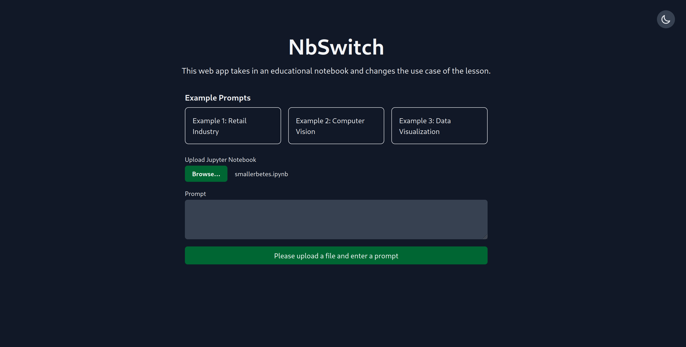
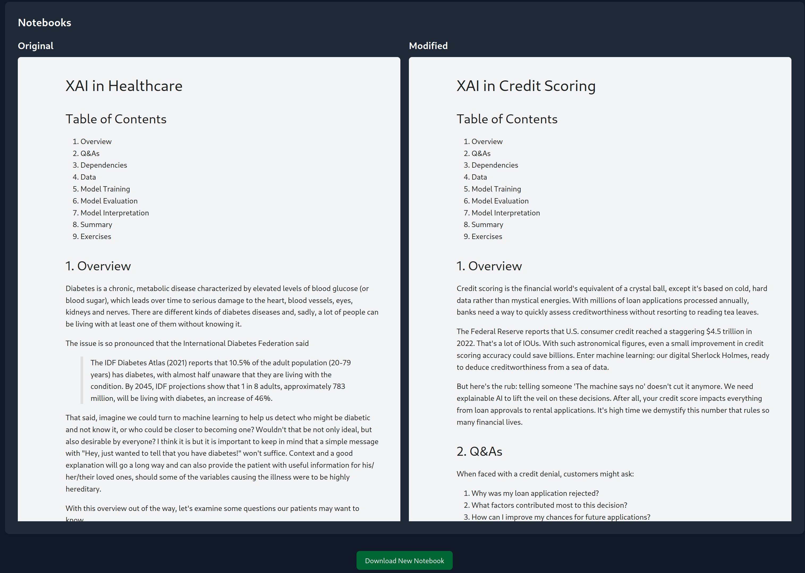

# NbSwitch

> NbSwitch let's you bring a notebook with educational content, describe a new use case, and change the original one to that using Claude Sonnet 3.5!



There are thousands of incredible educational notebooks out there that could be shown some love, and, what if that meant that, in the 
case of data-related topics, for example, changing the use case of any given notebook to a completely new one? That's what NbSwitch is for. :sunglasses:

The app can be found [live here](https://nbswitch.fly.dev/). 

**Limitations**
- Make sure your notebook has not been run before you upload it.
- Don't add overly long notebooks, e.g., those requiring more than `max_tokens=4_096`. 



This project was created as part of Anthropic's June 2024 Hackathon and it was build using their Claude Sonnet 3.5 model.

While I made this app to participate in the Hackathon, I see a lot of value in this project and will continue to polish and host it for free 
for as long as I can. The code will remain open-source as well. :)

**Note:** The code in this repo is fresh out of the oven, meaning, its ugliness might offend people, its lack of tests might give 
some a cardiac arrest, and its lack of React or something similar in the front-end might... (I'll leave that last one to you).


## Set Up

Create an environment.

```sh
python -m venv venv
```
or

```sh
mamba create -n hackathon python=3.11
```

Activate your environment.

```sh
source venv/bin/activate
```

or 

```sh
mamba activate hackathon
```

Install the dependencies.

```sh
pip install -r requirements.txt
```

Run the app.

```sh
uvicorn main:app --reload
```


## Tech Stack

- `anthropic` - SDK to interact with Anthropic's suite of models.
- `instructor` - tool for enforcing structured output from LLMs using pydantic.
- `pydantic` - typescript for Python.
- `fastapi` - for processing and serving requests.
- `nbconvert` - to change notebooks from one format to another.
- `nbformat` - to manipulate the JSON structure of a notebook.
- `AlpineJS` - interactions in the front-end.
- `Pines UI` - Tailwind CSS and AlpineJS components.
- `HTMX` - for sending the request to the back-end.


## Roadmap

- [ ] Add support for markdown files
- [ ] Add support for marimo files
- [ ] Add example notebooks
- [ ] Add more example prompts
- [ ] Add interactivity
- [ ] Allow users to bring in notebooks with outputs